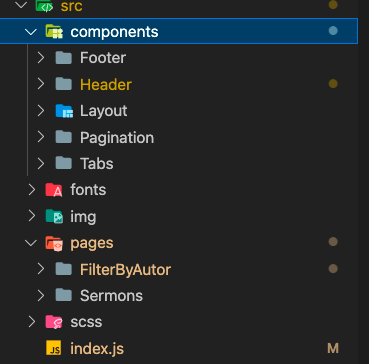

# lword template

# Contents

-   [Instalation](#instalation)
-   [Usage](#usage)
-   [Structure](#structure)

## Instalation

```
1. npm i
```

## Usage

Run following command:

```
 npm run start
```

## Structure

There are a couple of folders:



1.  **components** - all reusable components (such as footer, Header, etc)
2.  **pages** - all pages
3.  **scss** - global styles
4.  **img** - folder with all images
